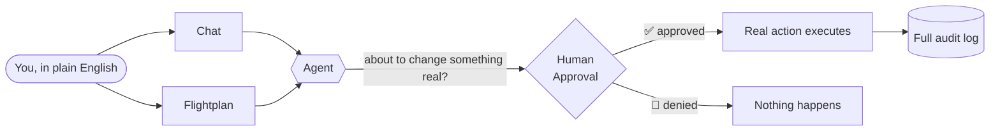

# 🛠️ OpsSquad

### Talk to your infrastructure in plain English. A human always approves before anything real happens.

OpsSquad is a team of specialist AI agents — code review, testing, security
scanning, deployment, incident response, cost analysis — that you either
chat with directly or chain into a repeatable, approval-gated pipeline
called a **Flightplan**. Every action is role-checked, every step is
logged with its full reasoning, and anything that would actually change
real infrastructure stops and waits for a person to say yes.



It's a working scaffold you can run today, not a slide deck — most of the
tools it uses genuinely execute: real `kubectl`, real `terraform apply`,
real container builds and vulnerability scans, real Prometheus alerts.

## ✨ Why people like it

- 🗣️ **Plain English in, real DevOps action out** — "scale down redis" or
  "ship this commit to prod" both just work.
- 🛑 **Nothing mutating runs without a yes** — two independent approval
  layers, checked server-side, not just hidden by the UI.
- 🔍 **Nothing is a black box** — every tool call, every reasoning step,
  every approval decision is visible and permanently logged.
- 🔐 **Least privilege everywhere** — every credential is scoped to the
  narrowest thing it needs, enforced by the platform, not a policy doc.
- 🧪 **Works with zero API key** — realistic simulated tool output lets you
  try the whole platform offline, no LLM required.
- 🖥️ **Bring your own model** — Claude or a self-hosted local LLM, your
  choice, per user.

## 🚀 Try it in 2 minutes

```bash
git clone <this repo> && cd OpsSquad
cp .env.example .env          # set your API key(s) — or leave blank to try it offline
docker compose up -d
docker compose exec postgres psql -U opssquad -d opssquad -f /db/seed.sql

open http://localhost:5173
#    login: admin@opssquad.dev / Admin@123
```

Prefer Kubernetes? `./k8s/bootstrap.sh` spins up a full local `kind`
cluster instead — same login, more real infrastructure targets. Details in
the [Kubernetes deployment guide](docs/guide/10-kubernetes-deploy.md).

## 📚 Full documentation

This README is the pitch. Everything else — architecture, every file in
the codebase explained, the database schema, the security model, the full
tool catalog, honest trade-offs and what's on the roadmap — lives in
**[`docs/INDEX.md`](docs/INDEX.md)**, organized simple → technical so you
only go as deep as you need.

| Curious about... | Read |
|---|---|
| What OpsSquad actually is, for a non-technical reader | [docs/guide/01-overview.md](docs/guide/01-overview.md) |
| How it's built, with diagrams | [docs/guide/02-architecture.md](docs/guide/02-architecture.md) |
| The 15 agents & how Flightplans work | [docs/guide/07-agents-and-flightplans.md](docs/guide/07-agents-and-flightplans.md) |
| Which actions are real vs. simulated | [docs/guide/08-tools.md](docs/guide/08-tools.md) |
| How approval gates & secrets management work | [docs/guide/09-security.md](docs/guide/09-security.md) |
| Every file in the frontend / API gateway / backend | [docs/guide/03](docs/guide/03-frontend.md) · [04](docs/guide/04-bff.md) · [05](docs/guide/05-runtime.md) |
| What's genuinely finished vs. still on the roadmap | [docs/guide/11-features-and-roadmap.md](docs/guide/11-features-and-roadmap.md) |

If you're an **AI coding assistant** picking this repo up cold, read
[`docs/AI-CONTEXT.md`](docs/AI-CONTEXT.md) first — it's built to answer
"what is this and what's the current state" cheaply, before you touch
anything else.

---

<sub>Default seed users for local use — change before any non-local
deployment: `admin@opssquad.dev` / `Admin@123` (admin), `dev@opssquad.dev`
/ `Dev@123` (dev), `viewer@opssquad.dev` / `Viewer@123` (viewer).</sub>
