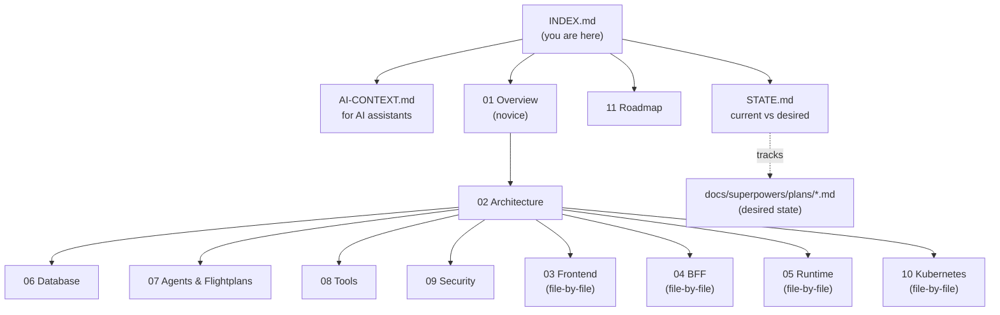

# OpsSquad Documentation

Welcome. This is the full documentation for OpsSquad, organized **simple → detailed**:
start at the top of this page for the big picture, follow links downward
only as deep as you need.

> **Are you an AI coding assistant?** Read [`AI-CONTEXT.md`](AI-CONTEXT.md)
> instead — one page, built to answer "what is this and what's the current
> state" without burning tokens on everything below.

---

## Start here (no technical background needed)

- [**01 — What is OpsSquad?**](guide/01-overview.md)
  Plain-language pitch: the problem, the solution, who it's for, honest
  advantages and disadvantages.

## How it's built (some technical background helpful)

- [**02 — Architecture**](guide/02-architecture.md)
  The big picture diagram, how a request flows through the system, how
  login/chat/Flightplans work step by step.
- [**06 — Database**](guide/06-database.md)
  What data is stored and how the tables relate.
- [**07 — Agents & Flightplans**](guide/07-agents-and-flightplans.md)
  The 15 agents, what each one does, and how they chain into pipelines.
- [**08 — Tools: Real vs. Simulated**](guide/08-tools.md)
  Which actions genuinely touch infrastructure vs. return realistic fake data.
- [**09 — Security**](guide/09-security.md)
  Login, roles, approval gates, secrets management (Vault).

## Deep dives (developer-level, file by file)

- [**03 — Frontend**](guide/03-frontend.md) — every file in `frontend/src/`.
- [**04 — BFF (API Gateway)**](guide/04-bff.md) — every file in `bff/src/`.
- [**05 — Runtime (FastAPI)**](guide/05-runtime.md) — every file in `runtime/app/`.
- [**10 — Kubernetes Deployment**](guide/10-kubernetes-deploy.md) — every file in `k8s/`, and what `bootstrap.sh` actually does.

## Where the project is going

- [**11 — Features, Trade-offs & Roadmap**](guide/11-features-and-roadmap.md)
  What's genuinely finished, known limitations, and what's planned next.
- [**STATE.md**](STATE.md) — living snapshot of current vs. desired state
  (desired state = the design docs in `docs/superpowers/plans/`).

---

## Map of the documentation itself

---

## Keeping this documentation current

This tree describes the **current, real state of the code** — not a plan,
not a wish list. When the code changes, update the matching page in the
same change:

| You changed... | Update... |
|---|---|
| `frontend/src/**` | `guide/03-frontend.md` |
| `bff/src/**` | `guide/04-bff.md` |
| `runtime/app/**` | `guide/05-runtime.md` (and `07`/`08`/`09` if agents/tools/security changed) |
| `db/migrations/**` | `guide/06-database.md` |
| `k8s/**` | `guide/10-kubernetes-deploy.md` |
| A plan in `docs/superpowers/plans/` was implemented | `STATE.md` |

See [`AI-CONTEXT.md`](AI-CONTEXT.md)'s "Maintenance rule" for the short
version future AI sessions should follow.
