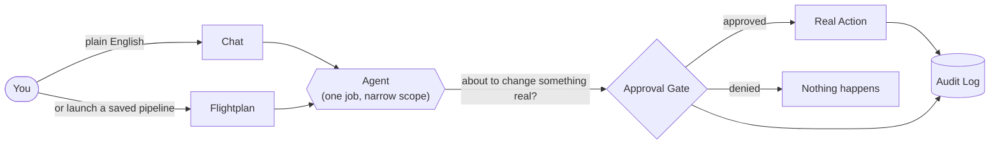

[← Back to Index](../INDEX.md)

# 01 — What is OpsSquad?

## The problem

DevOps work is a lot of repetitive, high-stakes typing: review a diff, run
tests, build an image, scan it for vulnerabilities, get a sign-off, deploy,
watch the metrics, roll back if something breaks. Every step lives in a
different tool. Every mistake — a fat-fingered `kubectl scale`, a deploy
with no rollback plan — can take down something real.

## The idea

OpsSquad is a **team of specialist AI agents you talk to in plain English**,
each one narrowly scoped to do one job well (review code, run tests, build,
scan, deploy, roll back, triage an incident, find wasted cloud spend...).
You either:

- **Chat with one agent directly** — "scan the latest image for CVEs" — and
  watch it work, live, step by step, with its reasoning shown.
- **Or launch a Flightplan** — a saved, repeatable pipeline that chains
  several agents together with a **human approval gate** before anything
  touches production.

Every account has a role (`viewer`, `dev`, `admin`). Every action is
checked against that role — twice, independently, so a UI bug can never
become a security hole. Every mutating action against a real system pauses
for a real person to say yes before it runs. Every action, approved or
denied, is written to a permanent audit log.

## Who it's for

- A team that wants **natural-language DevOps** without giving an LLM
  unsupervised write access to production.
- Anyone evaluating **how to safely wire an AI agent into real
  infrastructure** — OpsSquad is a working, inspectable reference for the
  pattern (RBAC, approval gates, audit trail, least-privilege credentials
  per tool), not just a chatbot wrapper.

## What makes it different (the honest pitch)

| | |
|---|---|
| ✅ **Real actions, not a demo.** | Most tools genuinely execute — real `kubectl`, real `terraform apply`, real container builds and vulnerability scans, real Prometheus/Alertmanager. See [Tools: Real vs. Simulated](08-tools.md). |
| ✅ **A human is always in the loop for anything that matters.** | Two separate, independent gates: one for "this agent is about to touch production," one for "this *specific command* changes real state," checked per role. See [Security](09-security.md). |
| ✅ **Least privilege by design, not by policy document.** | Every tool's credential is scoped as narrowly as the platform allows — the runtime's Kubernetes ServiceAccount can only touch its own namespace, Vault only hands each service the secrets it actually needs. |
| ✅ **Nothing is a black box.** | Every agent's reasoning, every tool call and its exact input/output, every approval decision — all persisted and visible in the UI, not just a final "done" message. |
| ⚠️ **It's a scaffold, not a finished product.** | Honest limitation, not a hidden one — see below. |

## Advantages

- **Safety-first architecture** — approval gates and RBAC aren't
  bolted on after the fact; they're structural (see
  [Security](09-security.md)).
- **Works with or without a paid LLM** — falls back to a deterministic
  keyword router and realistic simulated tool output with zero API key, so
  the whole platform (auth, RBAC, Flightplans, audit trail) is exercisable
  offline.
- **You can point it at your own local model** instead of a cloud API —
  tested end-to-end against a self-hosted `llama-server`.
- **Grounded, not theoretical** — the "real" tools point at real,
  self-contained targets (its own namespace, its own container, a local
  Terraform provider) instead of requiring a cloud account just to try it.

## Disadvantages (current limitations, stated plainly)

- **No real cloud account, registry, or Slack/PagerDuty workspace is
  touched by default** — `cloud.cost_explorer`, `slack.post`,
  `pagerduty.read`, and a few others return realistic simulated data unless
  you supply real credentials. See [Tools](08-tools.md) for exactly which.
- **No visual Flightplan builder yet** — new pipelines are written as YAML
  by hand; only the 3 seeded ones launch from the UI today.
- **Local-only Vault, no HA** — the self-hosted Vault used for the
  Kubernetes deployment runs in dev mode (in-memory); a production
  deployment needs a real storage backend + auto-unseal, or HCP Vault.
- **No SSO, no per-user cost caps** — not implemented yet.
- **A small local LLM's tool-call compliance is inconsistent** — reliable
  for some agents, occasionally just describes what it *would* do instead
  of calling the tool. Not a bug in OpsSquad — a known characteristic of
  small quantized models; Claude doesn't have this problem.

Full detail, with what's genuinely tested end-to-end vs. what's aspirational:
[Features, Trade-offs & Roadmap](11-features-and-roadmap.md).

## A typical first session

1. Log in as `admin@opssquad.dev` (seeded credentials shown on the login
   screen).
2. Open **Chat**, ask something read-only: *"find idle cost resources."*
3. Open **Flightplans**, execute `ship-to-prod` with a repo/commit.
4. Watch it run **live**: review → test → build → scan on the **Run
   Detail** page.
5. **Approve** the gate when it pauses for production sign-off.
6. Watch deploy → verify → (auto-rollback if verify fails) play out.
7. Check **Admin** to see the audit trail it left behind.

Next: [How it's built →](02-architecture.md)
