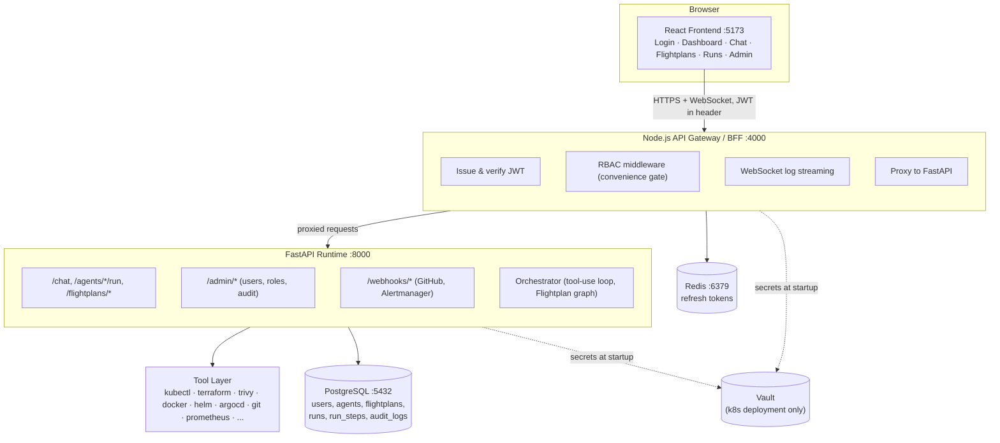
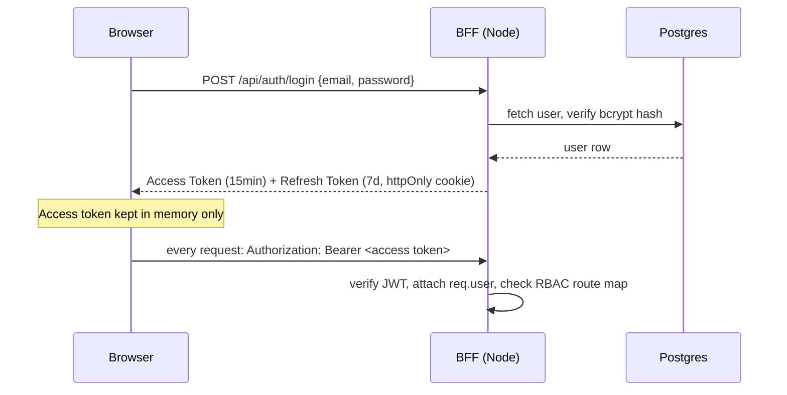
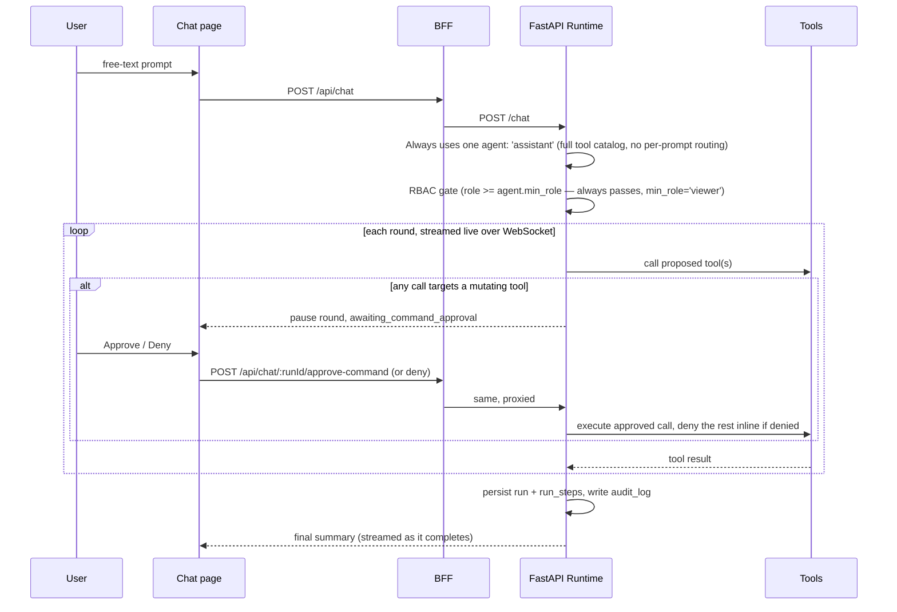
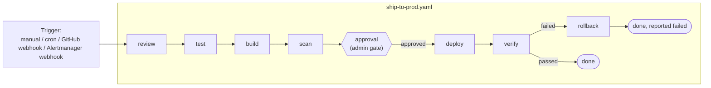

[← Back to Index](../INDEX.md)

# 02 — Architecture

## System diagram



**Why this shape:** the BFF is the only thing the browser ever talks to —
it never proxies raw LLM/tool calls, only issues/verifies JWTs and forwards
already-authenticated requests to FastAPI. FastAPI is the *only* Python
service — an earlier version split it into a second Flask "control plane"
for admin/webhooks, but that added an extra service, an extra dependency
tree, and an extra HTTP hop for no real gain, so it was folded back in.

## Request flow: login



Full RBAC matrix and JWT payload shape: [Security](09-security.md).

## Request flow: chat



Chat used to route each prompt to one of 15 specialist agents by keyword
match; that's gone (`orchestrator/router.py` deleted) — every chat prompt
now runs against one generalist `assistant` agent with the full tool
catalog, so the model itself decides what's relevant instead of a
keyword-score picking one narrow tool subset in advance. See [Agents &
Flightplans](07-agents-and-flightplans.md).

The **per-command mutation gate** shown above (any single mutating tool
call, any env) is the only mutation gate chat has — the old whole-run
"agent-level, `prod`-only" gate was dropped for chat as redundant.
Flightplans still have their own separate agent-level gate. Both are
covered in depth in [Security](09-security.md), including a real incident
found while shipping this: the per-command gate only lives in the live
LLM paths, and a third path (`_run_simulated`, used when no LLM is
reachable) had no gating at all until it was fixed.

## Request flow: a Flightplan run



Steps run in dependency order (`needs`), can carry a `when` condition, a
`policy.block_on` (fail the whole run on a matching severity), or
`guardrails` (clamp/refuse an out-of-bounds mutating action). A Flightplan
run never hits the per-command chat gate above — a step declaring a
mutating tool **is** the human's advance sign-off. Full anatomy: [Agents &
Flightplans](07-agents-and-flightplans.md).

## Directory map

```
frontend/   React + Vite            → 03-frontend.md
bff/        Node.js + Express       → 04-bff.md
runtime/    FastAPI (Python)        → 05-runtime.md
db/         Postgres schema + seed  → 06-database.md
flightplans/ YAML pipeline defs     → 07-agents-and-flightplans.md
k8s/        kind cluster manifests  → 10-kubernetes-deploy.md
```

Next: [Database →](06-database.md) · [Agents & Flightplans →](07-agents-and-flightplans.md)
