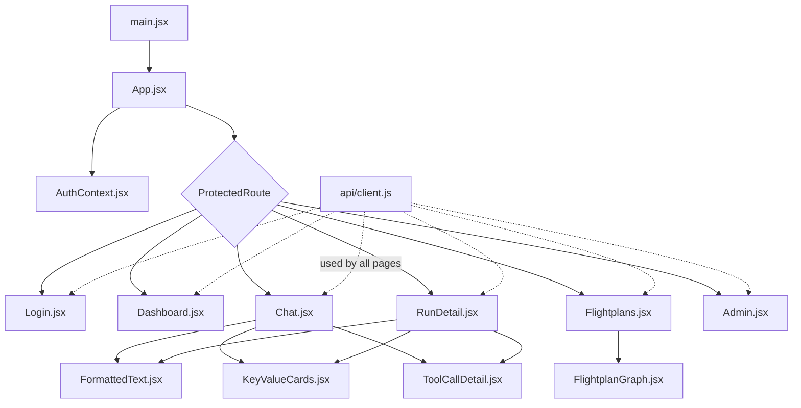

[← Back to Index](../INDEX.md) · [← Architecture](02-architecture.md)

# 03 — Frontend, file by file

React + Vite + TailwindCSS, talking only to the BFF (`bff/src`), never
directly to FastAPI. Dashboard pages: [see the page table in
01-overview.md](01-overview.md) for what each page does from a user's
perspective — this page is the developer-level file map.

## Entry & routing

| File | Purpose |
|---|---|
| `main.jsx` | React root. Wraps the app in `BrowserRouter` + `AuthProvider`. |
| `App.jsx` | Route table — maps each path to a page, wraps protected ones in `ProtectedRoute`. |
| `index.css` | Tailwind entrypoint only (`@tailwind base/components/utilities`). |

## Auth

| File | Purpose |
|---|---|
| `auth/AuthContext.jsx` | React context holding the current user + access token; login/logout; silent refresh on load. |
| `auth/ProtectedRoute.jsx` | Redirects to `/login` if unauthenticated; enforces a page's `minRole` client-side (server re-checks independently — see [Security](09-security.md)). |

## API client

| File | Purpose |
|---|---|
| `api/client.js` | One place every HTTP call to the BFF goes through — attaches the bearer token, exposes `runStreamUrl()` for the WebSocket. Also holds the in-memory access token (never `localStorage`). |

## Pages (`src/pages/`)

| File | Route | Purpose |
|---|---|---|
| `Login.jsx` | `/login` | Email + password form; seeded creds pre-filled for convenience. |
| `Dashboard.jsx` | `/` | Run history table, status color-coded, links into `RunDetail`. |
| `Chat.jsx` | `/chat` | Free-text prompt, staging/prod toggle, live round-by-round streaming over WebSocket, `ask_user` reply box, per-command Approve/Deny UI (`CommandApprovalBox`), model-provider status indicator. The most complex page in the app. |
| `Flightplans.jsx` | `/flightplans` | One card per saved Flightplan (name, description, env badge, dependency graph via `FlightplanGraph`), **Execute** button. |
| `RunDetail.jsx` | `/runs/:id` | Live step-by-step timeline over the same WebSocket, full tool-call detail per step, **Approve**/**Abort** actions. |
| `Admin.jsx` | `/admin` | User table with inline role dropdown, live audit log. |

## Shared components (`src/components/`)

| File | Purpose |
|---|---|
| `FormattedText.jsx` | Narrow formatter (not a full markdown parser — a deliberate scope choice) for the patterns agent-generated text actually produces: bullet lists, `**bold**`, `` `code` ``, and markdown tables rendered as real `<table>`. Shared by `Chat.jsx` and `RunDetail.jsx`. |
| `KeyValueCards.jsx` | Renders a flat object as label:value cards instead of a raw JSON dump — used for deterministic agent output. |
| `ToolCallDetail.jsx` | Renders one tool call's real input/result as labeled key:value pairs. Arrays of plain values are joined; arrays of objects (CVE lists, secret findings) are compacted to a count — the run's own LLM narration surfaces the notable ones in prose instead. |
| `FlightplanGraph.jsx` | Small dependency-graph renderer for a Flightplan's steps — computes each step's depth from its `needs` and lays out same-depth steps side by side. |

## Data flow for a chat message

1. `Chat.jsx` calls `api.chat(prompt, env)` → BFF → FastAPI, gets back a
   `run_id`.
2. Opens (or reuses) the `/ws/runs/:run_id` WebSocket via
   `runStreamUrl()`.
3. Each round's snapshot arrives over the socket; rendered via
   `FormattedText`/`KeyValueCards`/`ToolCallDetail` depending on shape.
4. If the run pauses (`awaiting_user_input` or
   `awaiting_command_approval`), the matching inline UI (reply box /
   Approve-Deny box) appears tied to that `run_id`.
5. `handleCommandDecision()` posts to `approve-command`/`deny-command` and
   the loop above continues.

Next: [BFF →](04-bff.md)
