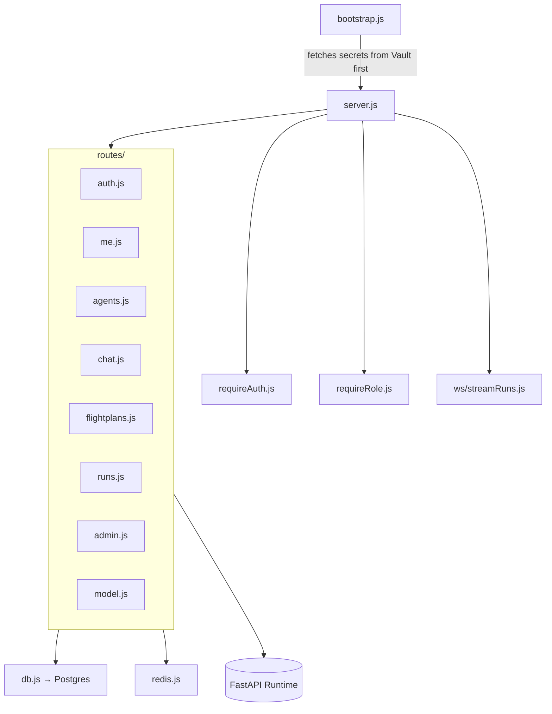

[← Back to Index](../INDEX.md) · [← Architecture](02-architecture.md)

# 04 — BFF (API Gateway), file by file

Node.js + Express. The **only** thing the browser talks to. Issues/verifies
JWTs, enforces RBAC as a convenience gate, proxies authenticated requests
to FastAPI, and streams run updates over a WebSocket. Never calls an LLM or
a tool directly.

## Entry point

| File | Purpose |
|---|---|
| `bootstrap.js` | **Real entrypoint** (see `Dockerfile CMD`) — fetches secrets from Vault *before* `server.js` is imported. Uses dynamic `import()` deliberately: a static import at the top of `server.js` would be hoisted and lock in stale env vars before the async Vault fetch could run. |
| `server.js` | Express app — mounts every route module, CORS, rate limiting, the WebSocket upgrade handler, JSON body parsing. |
| `config.js` | Reads `process.env` into one typed object — port, DB/Redis URLs, JWT secret (no usable default on purpose, see [Security](09-security.md)). |

## Auth & RBAC

| File | Purpose |
|---|---|
| `jwt.js` | Single source of truth for every JWT sign/verify call — pins `algorithms` explicitly (previously 3 call sites each did this ad hoc). |
| `middleware/requireAuth.js` | Verifies the `Bearer` token, attaches `req.user`. |
| `middleware/requireRole.js` | `roleAtLeast()` + `requireRole(minRole)` — a **convenience gate only**; FastAPI re-checks independently and never trusts this. |
| `middleware/asyncHandler.js` | Wraps async route handlers so a rejected promise reaches Express's error middleware instead of crashing the process (Express 4 doesn't catch these natively). |
| `vault.js` | Kubernetes-auth login to Vault using this pod's own ServiceAccount token — mirrors `runtime/app/vault.py`. Retries a failed login every 5s for ~3.3min instead of crashing (see [Security](09-security.md) for why). |

## Data access

| File | Purpose |
|---|---|
| `db.js` | `pg` connection pool. |
| `redis.js` | Redis client — refresh-token storage today. |

## Routes (`routes/`)

| File | Mounted at | Purpose |
|---|---|---|
| `auth.js` | `/api/auth` | login, refresh, logout — bcrypt verify, JWT issue, rate-limited. |
| `me.js` | `/api/me` | current user + preferences (`model_provider`, `model_name`, `tool_call_mode`). |
| `agents.js` | `/api/agents` | proxies agent list to FastAPI. |
| `chat.js` | `/api/chat` | proxies chat, `reply`, `approve-command`, `deny-command` to FastAPI (see [Security](09-security.md) for the last two). |
| `flightplans.js` | `/api/flightplans` | list/create/execute, queries Postgres directly for the list (not proxied). |
| `runs.js` | `/api/runs` | run history, approve, abort. |
| `admin.js` | `/api/admin` | user CRUD, role changes, audit log — `requireRole("admin")` on every route in the module. |
| `model.js` | `/api/model` | thin proxy to `local-model-control/agent.py` (host-run, outside the cluster) for local-LLM start/status. |

## Real-time updates

| File | Purpose |
|---|---|
| `ws/streamRuns.js` | `/ws/runs/:id` — no message broker is wired up, so live updates are done by **polling the DB every 2s** and pushing a diff-free snapshot. Documented as a real limitation, not a hidden one — swapping this for Redis pub/sub is a known future improvement. |

Next: [Runtime →](05-runtime.md)
