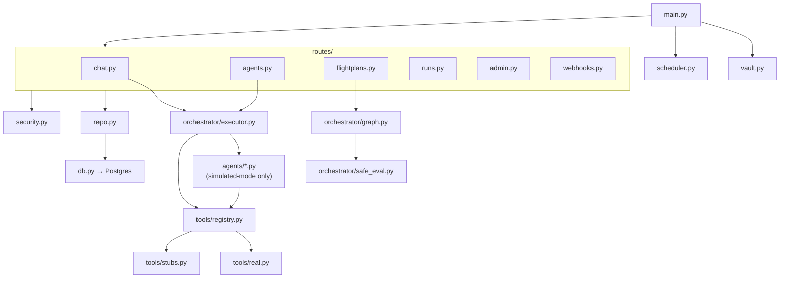

[← Back to Index](../INDEX.md) · [← Architecture](02-architecture.md)

# 05 — Runtime (FastAPI), file by file

The only Python service. Agent execution, LLM tool-use loops, Flightplan
orchestration, admin CRUD, webhooks. Everything in `runtime/app/`.

## Entry & wiring

| File | Purpose |
|---|---|
| `main.py` | FastAPI app + lifespan: loads Vault secrets, refuses to start on an empty/placeholder JWT secret, opens the DB pool, starts the in-process cron scheduler, mounts every route module. |
| `config.py` | Pydantic `Settings` — env-driven config, `REAL_TOOLS_ENABLED` flag, the blocklisted insecure default JWT secret. |
| `models.py` | Pydantic request/response models (`ChatRequest`, `ChatReplyRequest`, `AgentRunRequest`, `FlightplanExecuteRequest`, …). |
| `db.py` | `asyncpg` connection pool + JSON type codec. |
| `repo.py` | Every SQL query in the app — one place, no ORM. Agents/flightplans/runs/audit reads+writes. |
| `security.py` | `User` model, JWT verification, `current_user`/`require_role`/`role_at_least` FastAPI dependencies — the independent re-check behind the BFF's gate (see [Security](09-security.md)). |
| `vault.py` | Vault Kubernetes-auth login + secret fetch, with retry (see [Security](09-security.md)). |
| `scheduler.py` | In-process `asyncio` loop — no separate CronJob container — that fires a Flightplan when its `trigger.cron` is due. In-memory only, no durable job store (documented limitation, not a silent gap). |

## Routes (`routes/`)

| File | Purpose |
|---|---|
| `chat.py` | `POST /chat` — always runs the one `assistant` agent (`CHAT_AGENT_SLUG`, full tool catalog, no per-prompt routing), `POST /{run_id}/reply` (answer an `ask_user` pause), `POST /{run_id}/approve-command` / `deny-command` (per-command mutation gate — see [Security](09-security.md)). |
| `agents.py` | `GET /agents`, `POST /agents/{slug}/run` — direct single-agent execution. |
| `flightplans.py` | List/create/execute a Flightplan, `POST /flightplans/runs/{id}/approve` — resumes past an approval gate. |
| `runs.py` | `POST /runs/{id}/abort` — cooperative abort, checked between Flightplan steps. |
| `admin.py` | User CRUD, role changes, audit log with filters. |
| `webhooks.py` | `POST /webhooks/github` (HMAC-verified, push→`ship-to-prod`), `POST /webhooks/alertmanager` (bearer-token verified, fires `incident-response`). |

## Orchestrator (`orchestrator/`)

| File | Purpose |
|---|---|
| `executor.py` | **The core tool-use loop.** Runs one agent to completion against Claude, a local OpenAI-compatible server, or the simulated fallback (`_run_simulated`). Owns `MUTATING_TOOLS`, the per-command mutation gate (Claude/local paths only — `_run_simulated`'s generic fallback refuses mutating calls outright instead, see [Security](09-security.md)), `execute_paused_round`, `build_resume_messages`, the `ask_user` pseudo-tool. See [Agents & Flightplans](07-agents-and-flightplans.md). |
| `graph.py` | Executes a Flightplan's step graph — dependency order via `needs`, `type: approval` pause/resume, `when`/`policy` evaluation. Passes `pre_approved=True` into `run_agent` so Flightplan steps never hit the per-command chat gate. |
| `safe_eval.py` | Restricted AST evaluator for `when`/`policy` expressions. **Replaced a real `eval()` sandbox-escape vulnerability** (`().__class__.__bases__[0].__subclasses__()` reached arbitrary classes even with `__builtins__` blocked) — attribute access resolves as a dict-key lookup, never real `getattr()`. Never revert this to `eval()`. |

## Agents (`agents/`) — simulated-mode only

These 15 modules only run when there's no working LLM backend (no API key
and no reachable local model) — a real Claude/local-model run reasons over
the tools itself via `executor.py` instead of being routed through these
classes. Each encodes the agent's actual pass/fail logic so the rest of the
platform (RBAC, persistence, Flightplan branching) can be exercised with
realistic behavior, no LLM required. The chat `assistant` agent
deliberately has **no** module here — it's meant to be purely LLM-driven;
if it ever hits simulated mode it falls to `_run_simulated`'s generic
fallback instead (see [Security](09-security.md)).

| File | Agent slug | What it actually checks |
|---|---|---|
| `base.py` | — | `SimulatedAgent`/`AgentContext`/`AgentResult` base classes. |
| `registry.py` | — | `AGENT_REGISTRY` — slug → instance, `get_agent_impl()`. |
| `code_review.py` | `code-review` | Blocks on a committed secret found by `secrets.scan`. |
| `test_runner.py` | `test-runner` | Fails the run on any failing test from `test.run`. |
| `build.py` | `build` | `docker.build` → `docker.tag` → `registry.push`. |
| `security_scan.py` | `security-scan` | Blocks on a CVE severity matching its policy (default `CRITICAL`). |
| `deploy.py` | `deploy` | `helm.upgrade` → `argocd.sync`, checks rollout status. |
| `verify.py` | `verify` | Fails if the error rate from `prometheus.query` exceeds its threshold (default 2%). |
| `rollback.py` | `rollback` | `helm.rollback` + `argocd.rollback`, confirms via `kubectl.get`. |
| `incident_triage.py` | `incident-triage` | Reads an Alertmanager alert, assigns a flat `severity` (Flightplan `when` clauses reference it directly). |
| `diagnose.py` | `diagnose` | Pod logs + resource state → a recommended remediation. |
| `remediate.py` | `remediate` | Clamps an over-limit scale/restart request against a Flightplan step's `guardrails`. |
| `terraform_plan.py` | `terraform-plan` | Generates a plan, never applies. |
| `terraform_apply.py` | `terraform-apply` | Applies an already-approved plan. |
| `cost_analyzer.py` | `cost-analyzer` | Finds idle/oversized resources, estimates savings. |
| `postmortem.py` | `postmortem` | Drafts a markdown RCA from the run's own trace. |
| `notify.py` | `notify` | Posts a status update (`slack.post`). |

## Tools (`tools/`)

| File | Purpose |
|---|---|
| `base.py` | `Tool` ABC, `ToolResult`. |
| `registry.py` | `TOOL_REGISTRY` — simulated tools by default, real ones swapped in when `REAL_TOOLS_ENABLED=true` (the default). |
| `real.py` | **Real implementations** — genuinely shells out / calls real APIs. See [Tools: Real vs. Simulated](08-tools.md) for the full list and what each is grounded against. |
| `stubs.py` | Deterministic simulated tool implementations — the fallback, and the only mode for tools with no real target (`cloud.cost_explorer`, `slack.post`, etc. unless credentials are supplied). |
| `simulate.py` | Deterministic fake data generators, seeded by the tool's own input — same input always produces the same result, different input produces different (sometimes failing) results, so agent policy logic actually branches across runs. |
| `schemas.py` | Real per-tool JSON-schema `parameters` blocks sent to Claude/the local LLM as `input_schema` — without this the model had no idea what a param was called and guessed. |

## Tests (`runtime/app/tests/`)

No `pytest-asyncio` — async tests use plain `def test_*()` +
`asyncio.run(...)`. Run inside the runtime container/pod (the bare host
Python has no `pytest` installed).

| File | Covers |
|---|---|
| `test_ask_user_resume.py` | `build_resume_messages` wire format for both Claude and local-model providers. |
| `test_command_approval.py` | `execute_paused_round` — per-command mutation gate resume logic. |
| `test_safe_eval.py` | The restricted AST evaluator, including the sandbox-escape it closes. |
| `test_tool_schemas.py` | Every registered tool has a non-empty schema. |
| `test_vault_retry.py` | Vault login retries through transient 403s, gives up after `MAX_LOGIN_ATTEMPTS`. |
| `test_simulated_fallback_refuses_mutation.py` | `_run_simulated`'s generic fallback never touches `get_tool()` for a `MUTATING_TOOLS` name — regression test for the live incident, see [Security](09-security.md). |

Next: [Database →](06-database.md) · [Tools →](08-tools.md) · [Security →](09-security.md)
