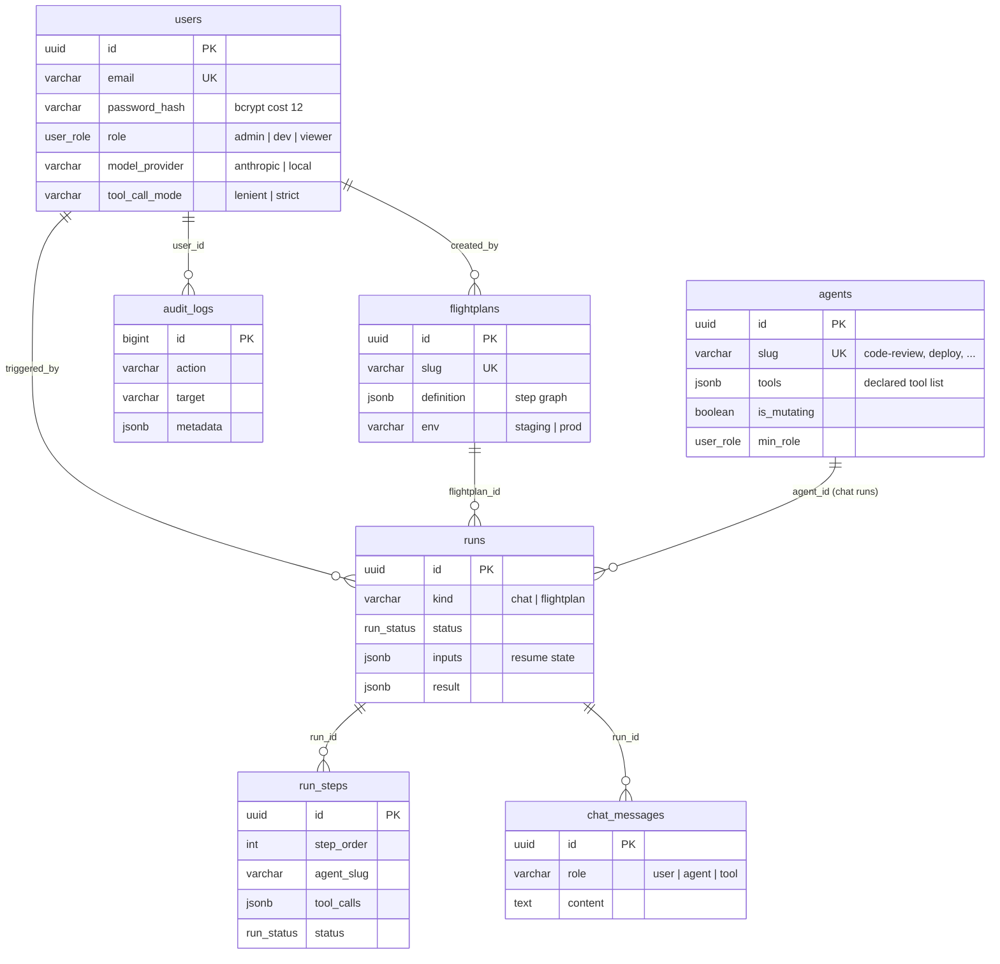
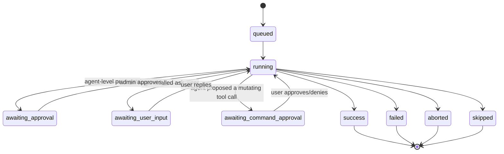

[← Back to Index](../INDEX.md) · [← Architecture](02-architecture.md)

# 06 — Database

PostgreSQL 16. One migration file, [`db/migrations/001_init.sql`](../../db/migrations/001_init.sql).
Default users + the agent registry are seeded by [`db/seed.sql`](../../db/seed.sql).

## Entity relationship diagram

## `run_status` — the state machine every run moves through

## Table notes (the non-obvious parts)

- **`runs.kind`** is `'chat'` or `'flightplan'` — one table for both, so
  Dashboard/audit history doesn't need a union query.
- **`runs.inputs`** doubles as resume state — a paused run's
  still-unanswered assistant turn (for `ask_user` or the per-command gate)
  is stashed here, not in a separate table, then read back by
  `execute_paused_round`/`build_resume_messages` on resume.
- **`run_steps.step_id`** is the Flightplan step's own YAML id (`"review"`,
  `"deploy"`) — `NULL` for chat runs, which have no step graph.
- **`run_steps.tool_calls`** is the full per-call `{tool, input, result}`
  trace — this is what `ToolCallDetail.jsx` renders, not `output` alone.
- **`chat_messages`** only exists to let a chat run resume with full
  history after an `ask_user` pause — it's not a general chat log.
- **`audit_logs`** is append-only, admin-viewable only, and is written for
  every mutating action anywhere in the system (Flightplan approval,
  per-command approve/deny, admin role change, etc.).

Next: [Runtime →](05-runtime.md) · [Agents & Flightplans →](07-agents-and-flightplans.md)
