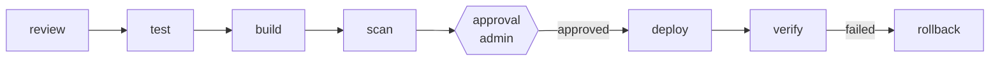
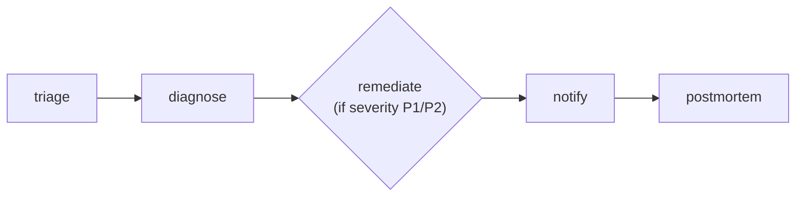

[← Back to Index](../INDEX.md) · [← Architecture](02-architecture.md)

# 07 — Agents & Flightplans

## The 15 agents

Seeded on first boot ([`db/seed.sql`](../../db/seed.sql)); logic lives one
module per agent under [`runtime/app/agents/`](../../runtime/app/agents/)
(simulated-mode only — a real LLM run reasons over the tools directly, see
[Runtime](05-runtime.md)).

| Slug | Purpose | Mutating? | Min role |
|---|---|:---:|---|
| `code-review` | Diff review — blocks on a committed secret | ❌ | dev |
| `test-runner` | Runs the impacted test suite, reports failures | ❌ | dev |
| `build` | Docker build, tag, push to registry | ✅ | dev |
| `security-scan` | CVE scan — blocks on a policy severity breach | ❌ | viewer |
| `deploy` | Helm upgrade / ArgoCD sync | ✅ | dev |
| `verify` | Smoke test + error-rate threshold check | ❌ | dev |
| `rollback` | Reverts to the last known-good release | ✅ | admin |
| `incident-triage` | Reads an alert, assigns severity | ❌ | viewer |
| `diagnose` | Pod logs + resource state → a recommended remediation | ❌ | viewer |
| `remediate` | Restart / scale / rollback, enforced against guardrails | ✅ | admin |
| `terraform-plan` | Generates a plan, never applies | ❌ | dev |
| `terraform-apply` | Applies an approved plan | ✅ | admin |
| `cost-analyzer` | Finds idle/oversized resources, estimates savings | ❌ | viewer |
| `postmortem` | Drafts a markdown RCA from the run's own trace | ❌ | viewer |
| `notify` | Posts a status update to a chat channel | ❌ | viewer |

"Mutating" (`agents.is_mutating` in the DB) drives the **agent-level**
gate — see [Security](09-security.md) for how that differs from the
**per-command** gate that checks the actual tool calls an agent makes.

## Anatomy of a Flightplan

A Flightplan is a YAML file (reference copies in
[`flightplans/`](../../flightplans/); the live, executed copy is JSON in
`flightplans.definition`, seeded from these files). Steps run in
dependency order via `needs`.

```yaml
steps:
  - id: scan
    agent: security-scan
    needs: [build]
    with: { tag: "${inputs.commit[:7]}" }   # templated from run inputs
    policy:
      block_on: [CRITICAL]                  # fail the whole run on this severity

  - id: approval
    type: approval                          # pauses until an admin approves
    needs: [scan]
    approvers: [admin]
    timeout: 2h

  - id: rollback
    agent: rollback
    needs: [verify]
    when: "${steps.verify.status == 'failed'}"   # conditional step
```

- **`with`** — templated inputs, `${inputs.x}` (run-level) or
  `${steps.<id>.field}` (another step's output).
- **`when`** — a condition, evaluated by `safe_eval.py`'s restricted AST
  evaluator (not real `eval()` — see [Runtime](05-runtime.md)).
- **`policy.block_on`** — fails the whole run if a step's output matches a
  listed severity.
- **`guardrails`** — clamps or refuses an out-of-bounds mutating action
  (e.g. `remediate`'s `max_replicas`).
- **`type: approval`** — pauses the run (`awaiting_approval`) until a
  listed approver role approves via `POST /flightplans/runs/{id}/approve`.

The run's final status reflects whether *any* step failed — a run that
failed and auto-rolled-back is reported `failed`, not `success`.

## The 3 seeded Flightplans

### `ship-to-prod.yaml` — manual/GitHub-webhook triggered



review → test → build → scan → **human approval** → deploy → verify →
auto-rollback on failure. A `push` to `main`/`master` on GitHub maps into a
real run of this via the webhook (`repo`/`commit` from the payload).

### `incident-response.yaml` — Alertmanager-webhook triggered



triage → diagnose → **remediate** (guardrailed: `allowed_actions`,
`max_replicas`) → notify → postmortem. `remediate` only runs `when` the
triaged severity is `P1` or `P2`. Fires automatically when Alertmanager
POSTs to `/webhooks/alertmanager`.

### `cost-sweep.yaml` — cron triggered

Meant to run nightly (`trigger.cron`, picked up by `runtime/app/scheduler.py`):
find idle resources → open a right-sizing PR (plan only, never applies).

Next: [Tools →](08-tools.md) · [Security →](09-security.md)
