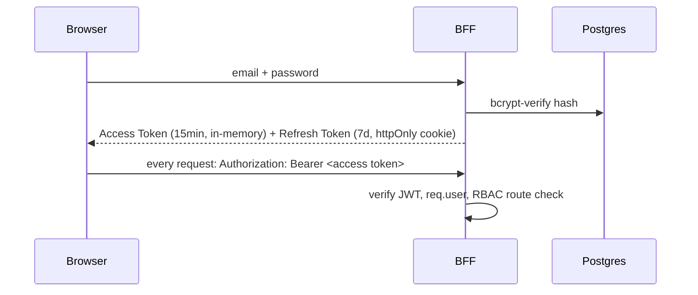
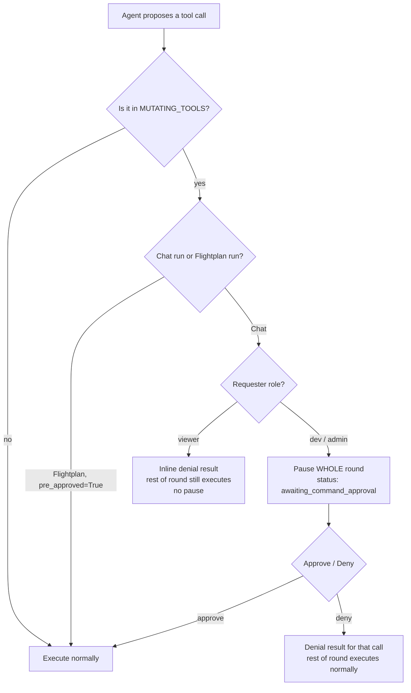
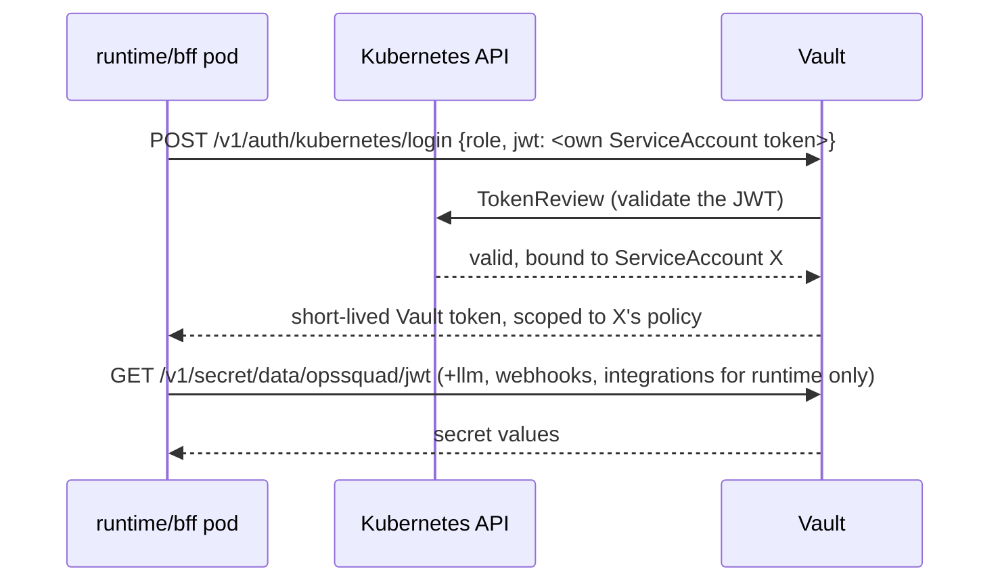

[← Back to Index](../INDEX.md) · [← Architecture](02-architecture.md)

# 09 — Security

## Auth flow



JWT payload:
```json
{ "sub": "u_8f21c9", "email": "admin@opssquad.dev", "role": "admin", "iat": 1757000000, "exp": 1757000900 }
```

**Defense in depth:** the BFF's RBAC middleware
(`bff/src/middleware/requireRole.js`) is a UI convenience gate.
`runtime/app/security.py` re-verifies every check independently and never
trusts the BFF's decision — a bug in one layer can't become a privilege
escalation.

## Default seed users

> Change these before any non-local deployment — they exist only so the
> app is usable on first boot.

| Email | Password | Role |
|---|---|---|
| `admin@opssquad.dev` | `Admin@123` | **admin** |
| `dev@opssquad.dev` | `Dev@123` | **dev** |
| `viewer@opssquad.dev` | `Viewer@123` | **viewer** |

## RBAC permission matrix

| Action | admin | dev | viewer |
|---|:---:|:---:|:---:|
| View dashboard & run history | ✅ | ✅ | ✅ |
| View logs & agent output | ✅ | ✅ | ✅ |
| Use chat agent (read-only agents) | ✅ | ✅ | ✅ |
| Use chat agent (write/deploy agents) | ✅ | ✅ | ❌ |
| Create / edit Flightplans | ✅ | ✅ | ❌ |
| Execute Flightplan — any env | ✅ | ✅ | ❌ |
| Approve a gated step | ✅ | ❌ | ❌ |
| Manage users & roles | ✅ | ❌ | ❌ |
| View audit log | ✅ | ❌ | ❌ |

A dev **can** trigger a `prod` Flightplan — it just stops at that
Flightplan's own approval step (admin-only) before any mutating agent
runs. Within a Flightplan, each individual agent's `min_role` is also
re-checked against whoever triggered the run.

## Two independent mutation gates

Easy to conflate — they check different things, at different layers:

| | Agent-level gate | Per-command gate |
|---|---|---|
| Checks | `agents.is_mutating` (whole agent) | Each individual tool call proposed mid-round |
| Scope | `env == 'prod'` only | Any env |
| Where | `routes/flightplans.py` (old, agent-selection time) | `orchestrator/executor.py` — `MUTATING_TOOLS` (new, per tool call) |
| Applies to | Flightplan agent selection | Chat runs only |
| Who resolves it | admin | The requesting dev/admin (viewer: auto-denied, no pause) |
| Flightplan runs | Always applies | **Never applies** — `pre_approved=True`, the step itself is the sign-off |



**Why pause the whole round, not just the gated call:** the LLM API's tool
protocol requires every proposed call in a round to get an answer before
the next turn — so a gate on any one call holds the entire round; on
resume, every call executes (the gated one per the decision, the rest
normally, since they were never denied, just held alongside).

Mutating tool set: `kubectl.restart`/`scale`, `terraform.apply`,
`helm.upgrade`/`rollback`, `argocd.sync`/`rollback`, `docker.build`/`tag`,
`registry.push`. Full list with real targets: [Tools](08-tools.md).

**Known simplification:** if a single round proposes two *different*
mutating calls (rare), both are approved/denied together as one decision —
no per-call granularity within a round. Left as a `ponytail:` comment at
the gate rather than built further, since it hasn't actually been hit.

**Endpoints:** `POST /chat/{run_id}/approve-command` /
`.../deny-command` (both BFF and FastAPI) — same ownership check as
`/reply`.

## Secrets management (Vault, Kubernetes deployment only)

`JWT_SECRET`, `ANTHROPIC_API_KEY`, `OPENAI_API_KEY`, `GITHUB_WEBHOOK_SECRET`,
`ALERTMANAGER_WEBHOOK_TOKEN` are fetched from Vault at startup, not read
from a plain k8s `Secret`.



- No static Vault credential is ever stored in either app's config.
- Each service's Vault policy only grants the paths it actually needs — bff
  can't read the Anthropic key, for instance.
- Both services **refuse to start** if `JWT_SECRET` ends up empty or still
  the old public placeholder (`change-me-to-a-long-random-string`),
  whether that came from Vault or a plain env var.
- `POSTGRES_PASSWORD`/`DATABASE_URL` stay on the plain k8s `Secret` —
  Postgres is an unmodified image with no way to speak to Vault.
- docker-compose is untouched — no Vault there, plain env vars, same
  fail-closed check.

### Vault runs in dev mode — and why that's tolerated, not ignored

Vault (`k8s/06-vault.yaml`) runs `-dev` (in-memory, no HA) — a deliberate
scope choice for the local `kind` cluster. **Any Vault pod restart wipes
its entire auth config.** A CronJob
([`k8s/07-vault-init-job.yaml`](../../k8s/07-vault-init-job.yaml)) re-runs
every 2 minutes, idempotently, to self-heal it.

That still leaves a window: a runtime/bff pod that boots right after a
Vault restart, before the next CronJob tick, used to hard-crash on the
first login attempt — root-caused from real `CrashLoopBackoff` pods in the
live cluster (`httpx.HTTPStatusError: 403` / `getaddrinfo EAI_AGAIN vault`
in the crash logs). Fixed: both `runtime/app/vault.py` and `bff/src/vault.js`
now retry the login call every 5s for up to ~3.3 minutes (comfortably past
the 2-minute self-heal cycle) before giving up. See
[STATE.md](../STATE.md) for the exact commits and verification.

A real deployment needs a real storage backend + auto-unseal, or HCP
Vault — this local setup only proves the integration pattern
(Kubernetes-auth login, scoped policies, fetch-at-startup) genuinely works.

Next: [Tools →](08-tools.md) · [Kubernetes Deployment →](10-kubernetes-deploy.md)
