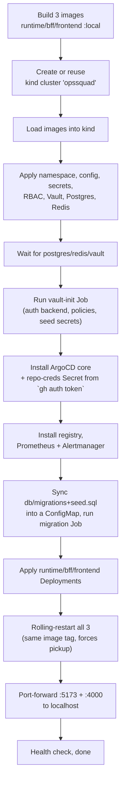

[← Back to Index](../INDEX.md) · [← Architecture](02-architecture.md)

# 10 — Kubernetes Deployment, file by file

Everything in [`k8s/`](../../k8s/). One `kind` cluster named `opssquad`,
one `bootstrap.sh` that builds, deploys, and wires up every real tool
target (registry, ArgoCD, Prometheus/Alertmanager) alongside the app
itself.

## `bootstrap.sh` — what it actually does, in order



Fully idempotent — safe to re-run any time to pick up new code. Uses its
own `kubectl --context kind-opssquad` throughout, so it never disturbs
your current kube context.

## Manifests, in apply order

| File | What it creates | Notes |
|---|---|---|
| `00-namespace.yaml` | `opssquad` namespace | |
| `01-configmap.yaml` | Non-secret app config | |
| `02-secret.yaml` | `DATABASE_URL`, `POSTGRES_PASSWORD` | Everything else moved to Vault — see below and [Security](09-security.md) |
| `05-rbac.yaml` | `runtime`/`bff` ServiceAccounts + `runtime-agent` Role/RoleBinding | Least-privilege — pods/logs/deployments/secrets/services, `opssquad` namespace only. `bff`'s ServiceAccount exists only so Vault can bind a policy to it by name. |
| `06-vault.yaml` | Vault Deployment (dev mode) + `vault` ServiceAccount + `system:auth-delegator` ClusterRoleBinding | The ClusterRoleBinding is required for Vault's own TokenReview calls — without it every login 403s. |
| `07-vault-init-job.yaml` | `opssquad-vault-init` CronJob (every 2 min) | Enables KV v2 + Kubernetes auth, writes policies/roles, seeds secret values. Self-heals dev-mode Vault's in-memory config after any restart — see [Security](09-security.md). |
| `08-argocd-namespace.yaml` / `08-argocd-core-install.yaml` | `argocd` namespace + vendored core-install | Application-controller + repo-server + redis only — deliberately no UI/server/dex, since `argocd.sync`/`rollback` drive the Application CRD directly via `kubectl patch`. |
| `09-argocd-app.yaml` / `09-argocd-rbac.yaml` | AppProject + Application + cross-namespace RBAC | The AppProject is required — core-install has no default one. |
| `10-postgres.yaml` / `11-redis.yaml` | Postgres (with PVC) + Redis Deployments | |
| `12-registry.yaml` | Self-hosted Docker Registry | Real `registry.push`/`pull` target, no auth/TLS, cluster-internal only, no persistence (safe to lose on restart). |
| `13-observability.yaml` | Prometheus + Alertmanager | Real `prometheus.query`/`alertmanager.read` targets; Alertmanager's webhook POSTs to `/webhooks/alertmanager`, closing the `incident-response` loop for real. |
| `20-migration-job.yaml` | One-shot migration Job | Reads the `opssquad-sql` ConfigMap, which `bootstrap.sh` regenerates from `db/migrations/`+`db/seed.sql` every run — always matches checked-in source, never a stale copy. |
| `30-runtime.yaml` / `32-bff.yaml` / `33-frontend.yaml` | App Deployments + Services | |
| `argocd-demo/configmap.yaml` | The one resource the demo Application owns | Deliberately separate from the Helm canary release so the two tools never fight over one object. |
| `port-forward.sh` | Standalone port-forward-with-auto-restart script | `kubectl port-forward` dies (doesn't reconnect) whenever its pod is replaced by a rollout or Vault's self-heal restart — this loops and restarts it automatically. |

## Operating the cluster

```bash
./k8s/bootstrap.sh                              # build + deploy + port-forward, idempotent
kill $(cat /tmp/opssquad-k8s-port-forward.pids) # stop port-forwards
kind delete cluster --name opssquad             # full teardown
```

Next: [Security →](09-security.md) · [Tools →](08-tools.md)
